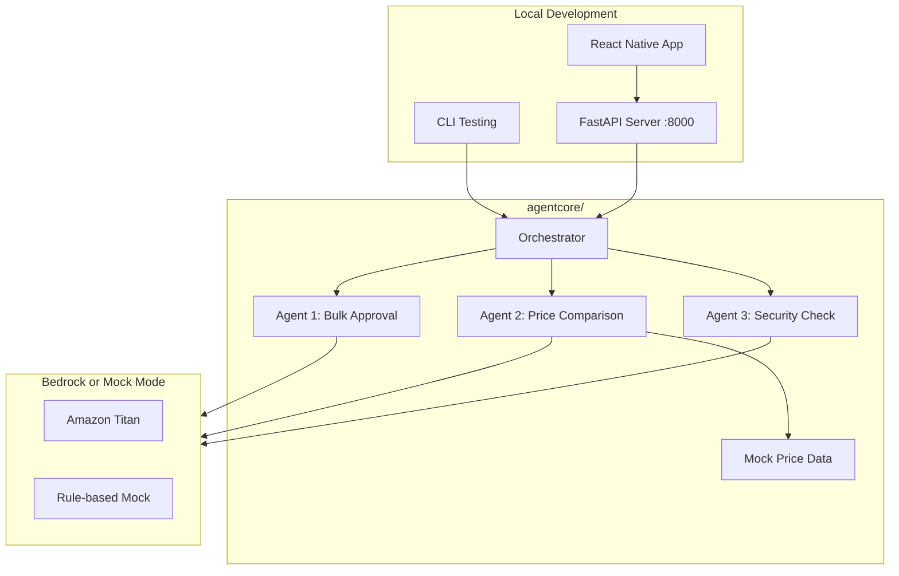
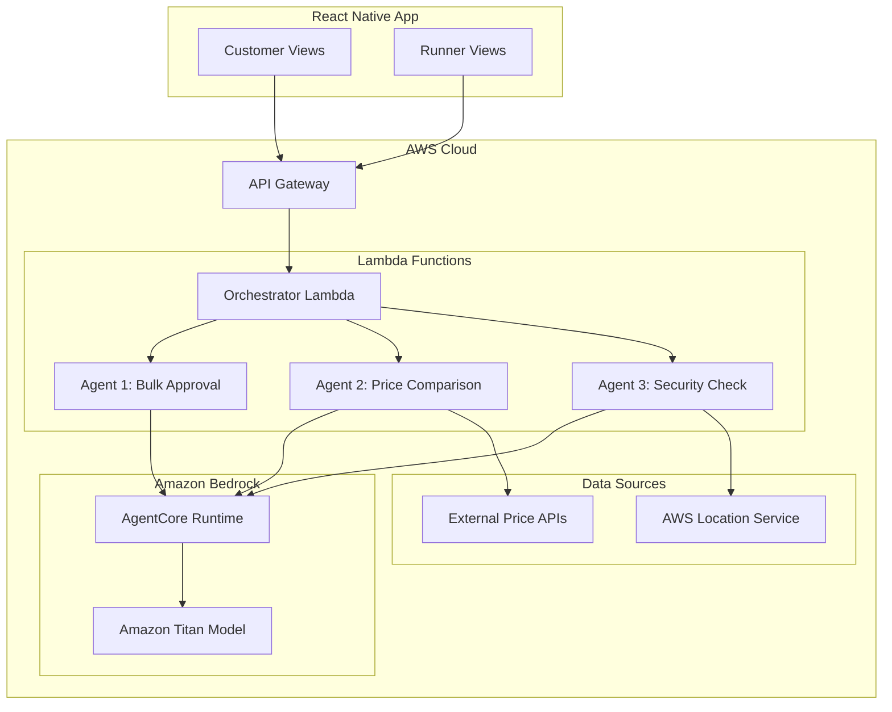
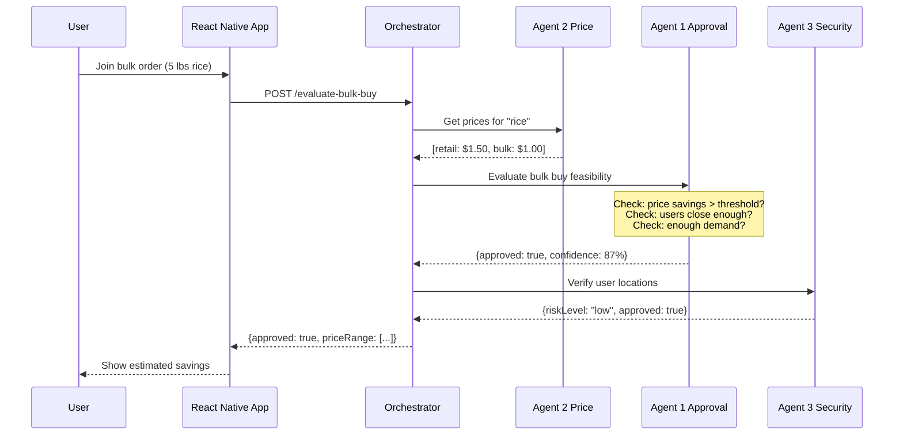

# Bulk Buy Agents with Amazon Bedrock and Strands SDK

## Architecture

### Local Development Mode



### Production Mode (AWS Lambda)



## Transaction Flow Integration



## Project Structure

```
agentcore/
├── requirements.txt              # Dependencies (strands-agents, boto3, etc.)
├── .env.example                  # Environment variables template
├── config/
│   ├── __init__.py
│   └── settings.py               # AWS config, model settings, mock mode toggle
├── tools/
│   ├── __init__.py
│   ├── price_tools.py            # Price lookup tools for Agent 2
│   ├── location_tools.py         # Geospatial tools for Agents 1 & 3
│   └── calculation_tools.py      # Cost calculation utilities
├── agents/
│   ├── __init__.py
│   ├── bulk_approval_agent.py    # Agent 1: Bulk feasibility
│   ├── price_comparison_agent.py # Agent 2: Price lookup
│   └── security_agent.py         # Agent 3: Location verification
├── handlers/
│   ├── __init__.py
│   ├── orchestrator.py           # Main orchestrator (works for both local & Lambda)
│   └── lambda_handler.py         # AWS Lambda entry point
├── server/
│   ├── __init__.py
│   ├── main.py                   # FastAPI local server
│   └── routes.py                 # API route definitions
├── cli/
│   ├── __init__.py
│   └── test_agents.py            # CLI for testing agents directly
├── models/
│   ├── __init__.py
│   └── schemas.py                # Pydantic models for I/O
├── data/
│   └── mock_prices.json          # Mock price data for local testing
├── tests/
│   ├── test_agents.py
│   └── test_tools.py
├── template.yaml                 # SAM template for Lambda deployment
└── README.md
```

## Implementation Details

### Agent 1: Bulk Approval Agent

**Input:** `{item_name, quantity, user_locations: [{lat, long}], retail_price, bulk_price, bulk_minimum}`

**Logic:**

1. Calculate effective unit price: `bulk_total / (demand + modulo_remainder)`
2. Compare against retail: `bulk_unit_price < retail_price * 0.8` (20% savings threshold)
3. Check geographic spread using DBSCAN clustering (max 5-mile radius)
4. Verify demand meets 60%+ of bulk minimum

**Output:** `{approved: bool, confidence: 0-100, reasoning: string, effective_price: float}`

### Agent 2: Price Comparison Agent

**Input:** `{item_name}`

**Logic:**

1. Query external price APIs (or use curated price database)
2. Find retail sources (Walmart, Target, etc.)
3. Find wholesale sources (Costco, Restaurant Depot, etc.)
4. Return normalized per-unit prices

**Output:** `{retail_price: float, bulk_price: float, bulk_minimum: int, sources: {retail: string, bulk: string}}`

### Agent 3: Security Agent

**Input:** `{user_id, user_location: {lat, long}, drop_zone: {lat, long}, trust_score}`

**Logic:**

1. Verify user location is within reasonable distance of drop zone
2. Check trust score against thresholds
3. Flag anomalies (too far, low trust, etc.)

**Output:** `{approved: bool, risk_level: "low"|"medium"|"high", reasons: string[], actions: string[]}`

## Key Files to Create

1. **[`agentcore/agents/bulk_approval_agent.py`](agentcore/agents/bulk_approval_agent.py)** - Agent 1 with Strands `@tool` decorators
2. **[`agentcore/agents/price_comparison_agent.py`](agentcore/agents/price_comparison_agent.py)** - Agent 2 for price lookups
3. **[`agentcore/agents/security_agent.py`](agentcore/agents/security_agent.py)** - Agent 3 for location verification
4. **[`agentcore/handlers/orchestrator.py`](agentcore/handlers/orchestrator.py)** - Core orchestrator (shared by local & Lambda)
5. **[`agentcore/server/main.py`](agentcore/server/main.py)** - FastAPI local server for testing
6. **[`agentcore/cli/test_agents.py`](agentcore/cli/test_agents.py)** - CLI tool for quick agent testing
7. **[`agentcore/template.yaml`](agentcore/template.yaml)** - SAM template for AWS deployment

## Dependencies

```
strands-agents>=0.1.0
strands-agents-tools>=0.1.0
boto3>=1.34.0
pydantic>=2.0.0
numpy>=1.24.0
fastapi>=0.109.0
uvicorn>=0.27.0
python-dotenv>=1.0.0
httpx>=0.26.0
typer>=0.9.0
rich>=13.0.0
aws-lambda-powertools>=2.0.0
```

## Local Testing

### Option 1: FastAPI Server (Recommended for App Integration)

Start the local server:

```bash
cd agentcore
pip install -r requirements.txt
python -m server.main
```

Server runs at `http://localhost:8000` with endpoints:

- `POST /api/evaluate-bulk-buy` - Full orchestration flow
- `POST /api/agents/price-comparison` - Agent 2 only
- `POST /api/agents/bulk-approval` - Agent 1 only
- `POST /api/agents/security-check` - Agent 3 only
- `GET /docs` - Swagger UI for testing

### Option 2: CLI Testing (Quick Agent Tests)

Test individual agents from command line:

```bash
# Test Agent 1 (Bulk Approval)
python -m cli.test_agents bulk-approval --item "rice" --quantity 10 --lat 41.82 --long -71.42

# Test Agent 2 (Price Comparison)
python -m cli.test_agents price-compare --item "jasmine rice"

# Test Agent 3 (Security Check)
python -m cli.test_agents security-check --user-lat 41.82 --user-long -71.42 --trust-score 4.5

# Run example flow from PRD
python -m cli.test_agents demo-flow
```

### Option 3: Mock Mode (No AWS Credentials Needed)

Set `MOCK_MODE=true` in `.env` to run without Bedrock:

```bash
# .env
MOCK_MODE=true
AWS_REGION=us-east-1
```

Mock mode uses rule-based logic instead of LLM calls - useful for UI development and testing the data flow.

### Option 4: pytest

```bash
cd agentcore
pytest tests/ -v
```

## Environment Configuration

Create `.env` from `.env.example`:

```bash
# Required for Bedrock (not needed in mock mode)
AWS_ACCESS_KEY_ID=your_key
AWS_SECRET_ACCESS_KEY=your_secret
AWS_REGION=us-east-1

# Agent settings
MOCK_MODE=false              # Set true to bypass Bedrock
BEDROCK_MODEL_ID=amazon.titan-text-premier-v1:0
SAVINGS_THRESHOLD=0.20       # 20% minimum savings
MAX_DISTANCE_MILES=5.0       # Max user spread
MIN_DEMAND_PERCENT=0.60      # 60% of bulk minimum
```

## AWS Resources Required (for Production)

- Amazon Bedrock access (with Titan model enabled)
- Lambda functions (Python 3.11+)
- API Gateway (REST API)
- IAM roles for Bedrock invocation
- Optional: AWS Location Service for advanced geospatial queries