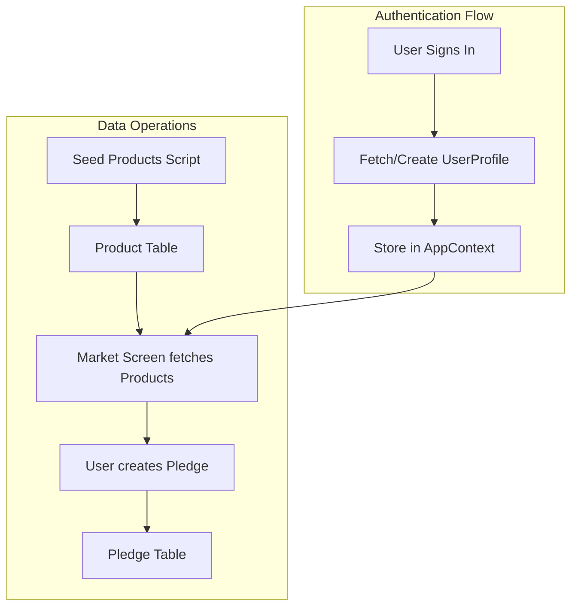

# DynamoDB Integration Plan

## Prerequisites (Before I Work)

1. **Run Amplify Sandbox** - Start the Amplify sandbox to deploy/sync the backend:
   ```bash
   cd /Users/devesh/Desktop/Coding/projects/hackbrown26
   npx ampx sandbox
   ```
   This will generate a fresh `amplify_outputs.json` with the correct endpoints.

2. **Create a Test User** - You need a Cognito user to test owner-based auth (UserProfile, Pledge tables require authentication):
   - Either use the app's auth screen to sign up, OR
   - Create a user via AWS Console in the Cognito User Pool

3. **Confirm Sandbox is Running** - Keep the sandbox terminal running while testing the app.

---

## Implementation Overview



### 1. Create Product Seeding Script
Create a Node.js script to populate the Product table with data from `mockProducts` in [`reactnativeapp/services/mockData.ts`](reactnativeapp/services/mockData.ts). This uses the AppSync API with an API key.

### 2. Update AppContext for Real User Data
Modify [`reactnativeapp/context/AppContext.tsx`](reactnativeapp/context/AppContext.tsx) to:
- Fetch the authenticated user's profile from DynamoDB on app load
- Create a UserProfile record if one doesn't exist (on first sign-in)
- Store real user data instead of mock data

### 3. Update Backend Service for UserProfile
Enhance [`reactnativeapp/services/backend.ts`](reactnativeapp/services/backend.ts) with:
- `createUserProfile()` - Create profile on first login
- `updateUserProfile()` - Update user data (role, location, etc.)

### 4. Connect Pledge Operations to Real Data
The Pledge CRUD operations already exist in `backend.ts`. Ensure:
- Pledges are created with the real authenticated `userId`
- Owner-based authorization allows users to read their own pledges

---

## Key Files to Modify

| File | Changes |
|------|---------|
| [`reactnativeapp/seed-dynamo.ts`](reactnativeapp/seed-dynamo.ts) | New - Seed Product table |
| [`reactnativeapp/context/AppContext.tsx`](reactnativeapp/context/AppContext.tsx) | Fetch/create UserProfile on auth |
| [`reactnativeapp/services/backend.ts`](reactnativeapp/services/backend.ts) | Add UserProfile CRUD functions |
| [`reactnativeapp/services/api.ts`](reactnativeapp/services/api.ts) | Wire up UserProfile API |

---

## What Gets Stored Where

| Table | Data | Auth |
|-------|------|------|
| **UserProfile** | name, email, phone, role, location, trustScore, joinedAt | Owner (Cognito user) |
| **Pledge** | userId, productId, quantity, status, amounts | Owner (Cognito user) |
| **Product** | name, category, prices, store info | Public (API key readable) |