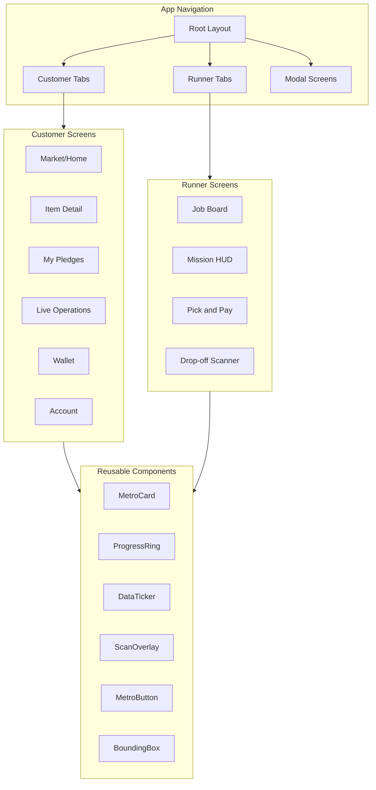

# Metropolis Bulk Buy Delivery App - Frontend Implementation

## Architecture Overview



## 1. Theme System and Design Foundation

Create the Metropolis design system in [`constants/theme.ts`](reactnativeapp/constants/theme.ts):

- **Colors**: Deep slate background (`#0A0E14`), electric cyan (`#00D9FF`) for confirmed states, warning orange (`#FF6B35`), success green (`#00FF88`), white headers, muted grays
- **Typography**: Sans-serif headers (Rajdhani/Exo 2 for futuristic feel), monospace for all data/prices/times
- **Spacing**: 4px base unit grid system
- **Effects**: Glassmorphism backgrounds, subtle glow effects, scan-line overlays

## 2. Core UI Components

Create reusable Metropolis-styled components in `components/metro/`:

| Component | Purpose |

|-----------|---------|

| `MetroCard` | Bounding-box container with corner accents and metadata labels |

| `MetroButton` | Sharp-edged buttons with glow states |

| `DataDisplay` | Monospace number/price displays with labels |

| `ProgressRing` | Circular progress for pledge completion |

| `StatusBadge` | Confidence scores, status indicators |

| `DataTicker` | Horizontal scrolling ticker for trending items |

| `ScanOverlay` | Camera viewfinder with corner brackets |

| `PulseRadar` | Animated radar effect for location/scanning |

## 3. Customer View Screens

### Tab Structure

- **Market** (home) - Trading floor with item listings and tickers
- **Pledges** - Active pledges and rollover items
- **Operations** - Live mission tracking map
- **Wallet** - Balance, transaction history, trust score
- **Account** - Settings, payment info, role switch

### Key Screen Features

- **Market**: Trending tickers at top, filterable item cards showing pledge progress bars, bulk vs retail price comparison, "Join Bulk Buy" action
- **Item Detail Modal**: Agent comparison graph, confidence score, pledge quantity selector
- **My Pledges**: Locked funds visualization, cancel option (if bulk not met), greyed-out executed orders
- **Live Operations**: Matrix-style map placeholder, runner location, route visualization
- **Wallet**: Active vs realized pledges, community trust score, discount credits

## 4. Runner View Screens

### Tab Structure  

- **Jobs** - Available missions job board
- **Mission** - Active mission HUD with map and status
- **Checklist** - Pick and pay item list
- **Scanner** - QR code scanner for drop-off verification

### Key Screen Features

- **Job Board**: High-contrast mission cards with earnings, cargo volume, accept/reject
- **Mission HUD**: Full-screen map with metropolis overlay, state indicator, action button
- **Pick and Pay**: Checklist with items/quantities, virtual card display, receipt scan option
- **Drop-off Scanner**: Camera viewfinder, neighbor list, scan-to-confirm flow

## 5. Mock Data and Services

Create `services/` directory with dummy implementations:

- `mockData.ts` - Sample items, users, pledges, missions
- `api.ts` - Simulated API calls with delays for realistic UX
- `agents.ts` - Mock agent decision functions (bulk approval, pricing)

## 6. Project Setup Files

- Update `.gitignore` with React Native/Expo specifics
- Create comprehensive `README.md` with setup instructions
- Update `app.json` with proper app name and theme config

## File Structure

```
reactnativeapp/
├── app/
│   ├── _layout.tsx (updated with dark theme)
│   ├── (customer)/
│   │   ├── _layout.tsx
│   │   ├── index.tsx (Market)
│   │   ├── pledges.tsx
│   │   ├── operations.tsx
│   │   ├── wallet.tsx
│   │   └── account.tsx
│   ├── (runner)/
│   │   ├── _layout.tsx
│   │   ├── index.tsx (Job Board)
│   │   ├── mission.tsx
│   │   ├── checklist.tsx
│   │   └── scanner.tsx
│   └── item/[id].tsx (Item detail modal)
├── components/
│   └── metro/
│       ├── MetroCard.tsx
│       ├── MetroButton.tsx
│       ├── DataDisplay.tsx
│       ├── ProgressRing.tsx
│       ├── StatusBadge.tsx
│       ├── DataTicker.tsx
│       ├── ScanOverlay.tsx
│       └── PulseRadar.tsx
├── constants/
│   └── theme.ts (expanded Metropolis theme)
├── services/
│   ├── mockData.ts
│   ├── api.ts
│   └── agents.ts
├── types/
│   └── index.ts
└── context/
    └── AppContext.tsx (user role, cart state)
```

## Implementation Priority

1. Theme system and core components first (foundation)
2. Customer Market screen (main demo screen)
3. Customer Pledges and Wallet screens
4. Runner Job Board and Mission HUD
5. Scanner and verification flows
6. Polish animations and transitions